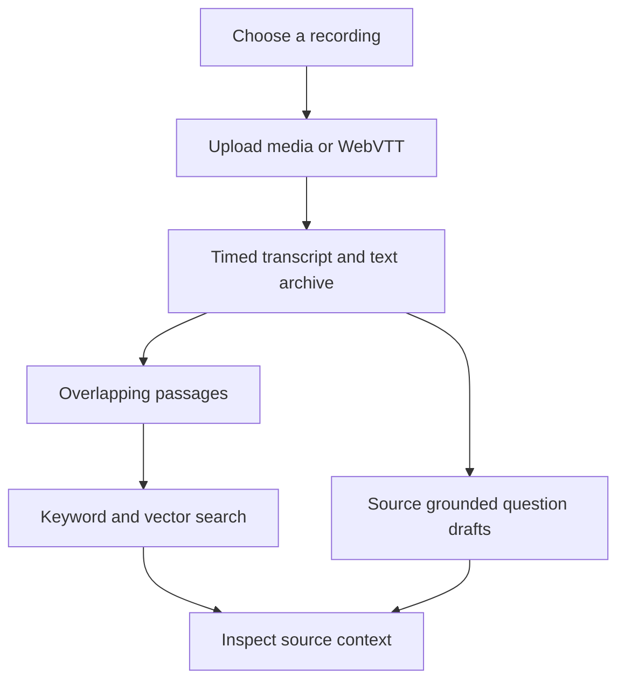

# Recording Atlas

**Make recorded knowledge findable again.**

Recording Atlas turns a recording into a timed transcript, a searchable archive, and draft questions that point back to the speaker's words. It runs on your computer and guides you through setup. You can explore an example without creating an account.

## Why I built it

My church had years of recorded sermons. The teaching was there, but finding a specific idea often meant knowing which recording to open and listening through it. Older recordings had very little searchable text. I wanted each sermon to keep helping people after the day it was delivered.

The original project grew into a content pipeline: transcribe the audio, preserve the source, prepare readable text, divide it into passages, make those passages searchable, and create questions and answers that could be checked against the teaching. Recording Atlas is a smaller public reconstruction of those ideas, built so someone else can try the workflow with their own material.

## What you can do

1. **Find a recording.** Paste a video, playlist, or website URL to collect recording references. You can also go straight to an upload.
2. **Add the source material.** Upload a timed WebVTT transcript or a supported audio or video file that you have permission to use.
3. **Build an archive.** The app keeps the raw transcript, prepares a readable version, and indexes passages with timestamps.
4. **Search and inspect.** Search by words or meaning and read the surrounding source passage.
5. **Review question drafts.** Optional generated questions use exact transcript excerpts as draft answers. You decide whether they represent the speaker faithfully.

A link identifies a recording. To process it, you still need to upload its media or transcript. This version does not download YouTube audio or captions.

## Try the experience

You need Python 3.11 or newer and a browser. The example does not require API keys, a database, or a model download.

```sh
git clone https://github.com/rader-ai/Recording-Atlas.git
cd Recording-Atlas
python3 run.py --open
```

On Windows, `py -3 run.py --open` may be the Python command. If a browser does not open, visit the local address printed in your terminal.

Choose **Explore the example**, then **Try the example archive**. Search for “volunteer orientation” or “protect eyes while soldering,” open a source passage, and explore the transcript. The six example recordings are original sample material written for this project. Their vectors are a transparent demonstration fixture, so this path shows the experience without claiming to measure a real embedding model.

To use your own material, start a separate workspace and choose **Use your own content**:

```sh
python3 run.py --data-dir ./build/my-archive --open
```

Connect an OpenAI API key, upload one recording or WebVTT transcript, review the processing scope, and start the import. Your own content uses paid API calls. Audio imports also need FFmpeg with `ffprobe`. Playlist discovery needs a YouTube Data API key. [The first run guide](docs/FIRST_RUN.md) walks through accounts, file limits, and setup issues.

## Systems worth exploring

| System | What it does | Why it matters |
| :--- | :--- | :--- |
| Guided onboarding | Checks Python, storage, media tools, and selected connections | A new user can understand what is required before starting paid work |
| Source discovery | Parses individual videos, pages, and up to 100 playlist entries | Discovery and selection happen before processing |
| Timed transcription | Accepts uploaded media or WebVTT and preserves source timestamps | A search result can lead back to the relevant moment |
| Resumable import | Gives jobs stable identities and saves completed stages | An interrupted archive import can resume without rebuilding every completed step |
| Incremental index | Hashes passages and embeds only changed content | Repeated imports avoid unnecessary model calls |
| Hybrid retrieval | Combines keyword and vector rankings with source context | People can search by wording or related meaning; keyword search remains available if vector search fails |
| Grounded drafts | Requires an exact excerpt from the cited transcript cue | Unsupported draft answers are rejected before review |
| Local controls | Keeps entered keys in server memory, restricts web discovery, and protects local API requests | The setup experience has explicit boundaries around credentials and fetched pages |

The app uses Python's standard library, a small HTML and JavaScript interface, OpenAI transcription and embeddings for real content, and optional YouTube Data API discovery. It stores the archive in local JSON files. There is no hosted account or database to configure.

## How it fits together



Some of the most important product decisions are invisible in a happy path. Raw and readable transcripts are separate so cleanup does not silently replace the source. The index is saved only after a complete build. Draft answers quote an exact cue and remain unpublished. The app asks for accounts only when a selected feature needs them. [The case study](docs/CASE_STUDY.md) explains the original opportunity and the decisions behind this reconstruction. [Architecture](docs/ARCHITECTURE.md) and [evaluation](docs/EVALUATION.md) cover the implementation and its evidence limits.

## What this version proves

The example setup, import, archive, and search flow passed a local HTTP check. The project has 42 automated tests covering retrieval, source validation, provider failures, job recovery, and credential handling. Run them with:

```sh
python3 -m unittest discover -s tests -v
```

The paid provider paths and live YouTube account connection have mock coverage but have not been exercised with real credentials in this reconstruction. The example vectors and queries are development fixtures, not an independent search quality benchmark. Question excerpts are checked for source presence, which still leaves interpretation to a person. This is a local single user application, not a hosted service.

This repo contains newly reconstructed code and original sample transcripts. It does not contain private recordings, customer data, credentials, or copied private source code. Coding agents assisted with this reconstruction. No open source license grant is included; contact me about broader reuse.
